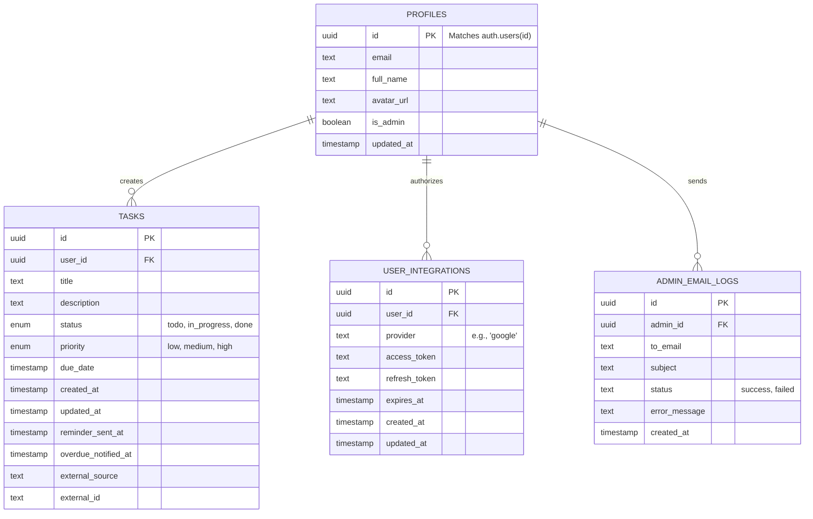

# Vector OS: The Ultimate Student Operating System

Welcome to the deep-dive documentation for Vector OS. This document explains the complete architecture, data models, UI features, automated workflows, and future roadmap that makes this application a robust academic companion.

---

## Index
1. [Login and Onboarding Flow](#1-login-and-onboarding-flow)
2. [The Core Dashboard](#2-the-core-dashboard)
3. [Google Calendar Integration](#3-google-calendar-integration)
4. [Email Automations](#4-email-automations)
5. [Architecture and Database Schema](#5-architecture-and-database-schema)
6. [SEO, Analytics, and AI Optimization](#6-seo-analytics-and-ai-optimization)
7. [Setting Up Locally](#7-setting-up-locally)
8. [Future Roadmap](#8-future-roadmap)

---

## 1. Login and Onboarding Flow

We prioritized frictionless authentication. Vector OS supports standard Email/Password authentication but heavily promotes Google OAuth for a seamless login experience. 

**Trust and Verification:** Our Google OAuth consent screen is officially verified in the Google Cloud Platform under the branding "Vector", ensuring users see a trusted logo and domain when granting permissions.

### Authentication Implementation
The authentication is managed entirely by Supabase Auth and Next.js middleware.

```typescript
// middleware.ts
import { type NextRequest } from "next/server";
import { updateSession } from "@/utils/supabase/middleware";

export async function middleware(request: NextRequest) {
  return await updateSession(request);
}

export const config = {
  matcher: [
    "/((?!_next/static|_next/image|favicon.ico|.*\\.(?:svg|png|jpg|jpeg|gif|webp)$).*)",
  ],
};
```

*(Check out the login flow in action below)*  


---

## 2. The Core Dashboard

The Home Page and Dashboard are the core of Vector OS. The UI is built using shadcn/ui components and customized with Tailwind CSS for a premium aesthetic, using the "Plus Jakarta Sans" typography.

When users first land on the dashboard, they are greeted by an interactive product tour (powered by `driver.js`). This automatically walks them through how to add a task, change statuses, and configure settings.

### Global State Management
Tasks are managed via a global Zustand store, which synchronizes directly with Next.js Server Actions. This ensures immediate optimistic UI updates without waiting for network responses.

```typescript
// Task Store Example
export const useTaskStore = create<TaskStore>((set) => ({
  tasks: [],
  setTasks: (tasks) => set({ tasks }),
  addTask: (task) => set((state) => ({ tasks: [...state.tasks, task] })),
  updateTaskStatus: (id, status) => set((state) => ({
    tasks: state.tasks.map(t => t.id === id ? { ...t, status } : t)
  })),
}));
```

*(Check out the landing page and dashboard interactions below)*  
  
  

---

## 3. Google Calendar Integration

Vector OS provides a native 2-way sync with Google Calendar via the official Google APIs.

By navigating to Settings, users can securely grant Vector OS permission to read their Google Calendar. The OAuth tokens are securely stored in the database.

### Integration Workflow
1. User clicks "Connect Google Calendar".
2. The application requests `https://www.googleapis.com/auth/calendar.readonly` scopes.
3. The server exchanges the authorization code for an `access_token` and `refresh_token`.
4. A background job uses the tokens to fetch events and map them into the local `tasks` table.

```typescript
// Generating the Auth URL dynamically based on environment
const oauth2Client = new google.auth.OAuth2(
  process.env.GOOGLE_CLIENT_ID,
  process.env.GOOGLE_CLIENT_SECRET,
  `${origin}/api/integrations/google-callback`
);

const url = oauth2Client.generateAuthUrl({
  access_type: 'offline',
  scope: ['https://www.googleapis.com/auth/calendar.readonly'],
  prompt: 'consent' // Forces it to return a refresh token every time
});
```

*(Watch how easy it is to connect your calendar)*  


---

## 4. Email Automations

Vector OS runs background cron jobs (via Vercel Cron) to send three distinct email templates via the Resend API. The email logic handles tracking to ensure users are not spammed.

### Cron Job Logic
We use standard HTTP GET requests triggered by Vercel Cron on strict schedules.

```typescript
// app/api/cron/daily/route.ts
export async function GET(req: Request) {
  // 1. Verify Vercel Cron Secret
  // 2. Query Supabase for tasks due within 24 hours (where reminder_sent_at is null)
  // 3. Query tasks that are overdue (where overdue_notified_at is null)
  // 4. Send emails via Resend
  // 5. Update timestamp columns in Supabase
}
```

<div align="center">
  <table>
    <tr>
      <td align="center" width="33%">
        <br>
        <b>Deadline Approaching</b><br>
        Sent 24 hours before a task is due so you have time to finish it.
      </td>
      <td align="center" width="33%">
        <br>
        <b>Deadline Overdue</b><br>
        A gentle nudge when a deadline slips by, helping you prioritize damage control.
      </td>
      <td align="center" width="33%">
        <br>
        <b>Weekly Wrap-up</b><br>
        Sent every Sunday to celebrate everything you accomplished, and list what's on deck for next week.
      </td>
    </tr>
  </table>
</div>

---

## 5. Architecture and Database Schema

### Tech Stack Overview
- **Framework:** Next.js 14 (App Router)
- **Styling:** Tailwind CSS, shadcn/ui
- **Database/Auth:** Supabase (PostgreSQL)
- **State Management:** Zustand
- **Emails:** Resend API
- **Automations:** Vercel Cron

### Database Schema (ER Diagram)
Our PostgreSQL schema uses strict Row Level Security (RLS) to ensure multi-tenant data isolation.



For a complete overview of our backend APIs and Server Actions, check out our Swagger UI Documentation at `vector.prodhosh.me/api-docs`.

---

## 6. SEO, Analytics, and AI Optimization

We treat Vector OS like a production SaaS platform.

### Meta Tags and Search Console
Dynamic Meta Tags, OpenGraph images, and meta descriptions are configured in `app/layout.tsx`. The domain is indexed and visible on Google Search via Google Search Console.

### Analytics Tracking
We use both Google Analytics and Vercel Analytics to track page views, feature usage, and core web vitals privately.

### LLM Optimization
We serve `/llms.txt` and `/llms-full.txt` at the root domain. This allows AI bots and search agents (like Perplexity or ChatGPT) to easily crawl the documentation and understand the application context without executing Javascript or navigating complex UIs.

---

## 7. Setting Up Locally

1. Clone the repository.
2. Run `npm install` to install dependencies.
3. Create a Supabase project. Navigate to the SQL editor and execute the queries found in `supabase/schema.sql` to initialize tables.
4. Copy `.env.local.example` to `.env.local`. Fill in your `NEXT_PUBLIC_SUPABASE_URL`, `NEXT_PUBLIC_SUPABASE_ANON_KEY`, and Google OAuth credentials.
5. Run `npm run dev` and open `http://localhost:3000`.

*(No need to run complex seed scripts; you can start adding tasks immediately)*

---

## 8. Future Roadmap

We are constantly expanding the Vector OS ecosystem to simplify workflows:
- **Notion and Alternative Calendars:** Integration for Notion databases and Apple/Outlook calendars to support diverse academic tooling.
- **Google Cloud Admin API:** Implementing a GCP Service Account to securely fetch and display live API usage statistics (such as Calendar Sync volume) directly in the Vector OS Admin Dashboard.
