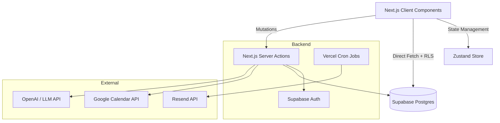

<div align="center">
  
  <br />
  <p>Your academic life, finally organized. A modern, kanban-driven operating system for students.</p>
  <br />
  <a href="https://vector.prodhosh.me">
    
  </a>
  &nbsp;
  <a href="https://vector.prodhosh.me/api-docs">
    
  </a>
</div>

<br />

<div align="center">
  
</div>

<br />

<div align="center" style="display: flex; align-items: flex-end; justify-content: center; gap: 20px;">
  
  
  
</div>

<br />

## Table of Contents
- [Why We Built This](#why-we-built-this)
- [Features](#features)
- [Future Plans](#future-plans)
- [Tech Stack](#tech-stack)
- [Architecture](#architecture)
- [API Documentation (Swagger)](#api-documentation-swagger)
- [Running Locally](#running-locally)

## Why We Built This

Most student planners are just too complicated. We spend hours setting up the "perfect system" only to abandon it a week later because it takes too much effort to maintain. 

We built Vector OS to be exactly what you need to stop losing track of assignments and just get work done. No bloat, no confusing setups. Just a simple Kanban board, a calendar, and some smart automations that do the heavy lifting for you.

## Features

### Core Task Management
- **Simple Kanban Boards:** Drag and drop your tasks between To Do, In Progress, and Done.
- **Priority & Deadlines:** Tag tasks as High, Medium, or Low, and set due dates.
- **Fast UI:** The dashboard updates instantly when you move things around.

### Automations That Actually Help
- **Google Calendar Sync:** Connect your account in settings. We'll automatically pull your Google Calendar events straight into your task board so you never miss a deadline.
- **Automated Email Reminders:** We run a daily background check to email you about approaching deadlines, overdue tasks, and a weekly wrap-up.
- **Email-to-Task:** Forward emails from your professors directly to your unique Vector inbox. We read it and create a task for you automatically.
- **Homepage Helper:** A simple chat assistant on the landing page to answer your questions and help you get started.


## Future Plans

Because our architecture is built to support scalable OAuth integrations, we are looking to expand our ecosystem soon while preserving our minimalist core interface:
- **Notion Integration:** Sync rows from your Notion databases directly into your Vector OS task list.
- **Canvas LMS:** Automatically pull in assignments and quizzes as soon as your professor posts them.
- **GitHub:** For CS students, sync assigned Issues and PR reviews.
- **Spotify & Pomodoro:** Native widgets for focus modes with your favorite study playlists.

<br />

## Tech Stack

We chose a modern, edge-ready stack optimized for speed and developer experience.

<div align="center">
  <table>
    <tr>
      <td align="center" width="25%">
        <br>
        <b>Next.js 14 & React</b>
      </td>
      <td align="center" width="25%">
        <br>
        <b>TypeScript</b>
      </td>
      <td align="center" width="25%">
        <br>
        <b>Tailwind CSS</b>
      </td>
      <td align="center" width="25%">
        <br>
        <b>Supabase & PostgreSQL</b>
      </td>
    </tr>
    <tr>
      <td align="center" width="25%">
        <br>
        <b>Vercel Crons</b>
      </td>
      <td align="center" width="25%">
        <br>
        <b>Git & GitHub</b>
      </td>
      <td align="center" width="25%">
        <br>
        <b>Zustand</b>
      </td>
      <td align="center" width="25%">
        <br>
        <b>Resend API</b>
      </td>
    </tr>
  </table>
</div>

## Architecture

We use a hybrid data fetching approach. Server Actions handle heavy mutations and secure API calls (like Google Calendar sync), while the Supabase Client fetches data directly from the client side, protected by strict Row Level Security (RLS) policies. Background notifications are handled natively via Vercel Crons.



## Running Locally

1. Clone the repository
```bash
git clone https://github.com/yourusername/student-task-management.git
cd student-task-management
```

2. Install dependencies
```bash
npm install
```

3. Set up Supabase
Create a new Supabase project and run the provided SQL queries in `supabase/schema.sql` to set up your tables.

4. Set up Environment Variables
Copy `.env.local.example` to `.env.local` and fill in your Supabase URL and Anon Key.

```bash
cp .env.local.example .env.local
```

5. Run the development server
```bash
npm run dev
```

Visit `http://localhost:3000` to see the app running.

## API Documentation (Swagger)

We fully document our backend using OpenAPI (Swagger). All database schemas, endpoint parameters, and response types are clearly defined.

You can view the interactive Swagger UI by visiting the `/api-docs` route in the browser, or by clicking the **API Docs** badge at the top of this README. The raw OpenAPI specification file is located at `docs/openapi.yaml`.

## Submission Details

This project was built as a full-stack student task management assignment. It fulfills all core requirements (CRUD, task organization, responsive UI) and all optional bonus features (Auth, Search, Due Dates, TypeScript, Error Handling).
