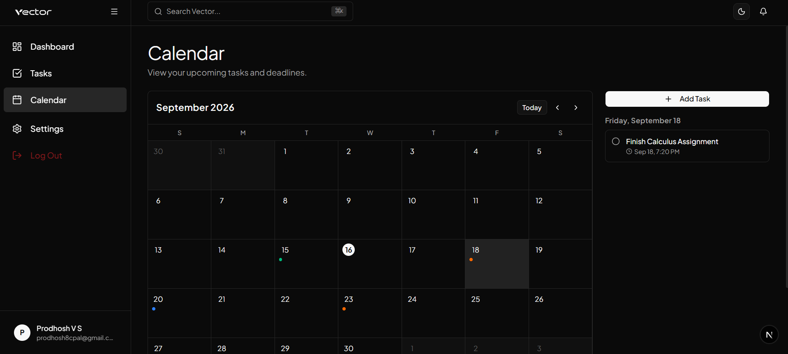
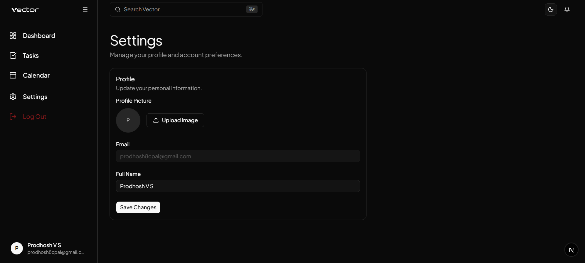
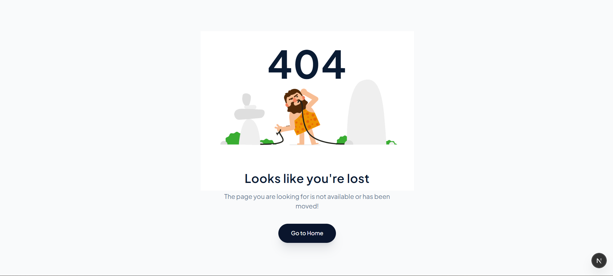
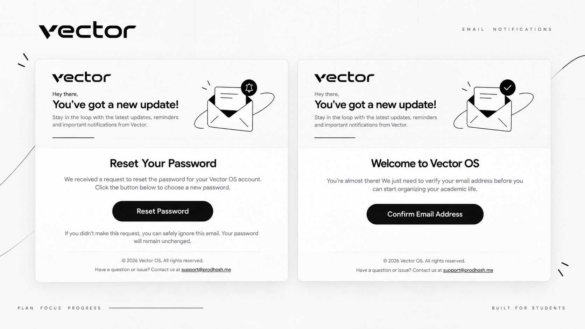
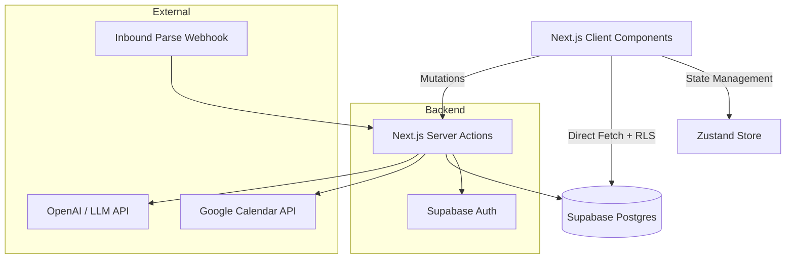

<div align="center">
  
  <br />
  <p>Your academic life, finally organized. A modern, kanban-driven operating system for students.</p>
  <br />
  <a href="https://vector.prodhosh.me">
    
  </a>
  &nbsp;
  <a href="https://vector.prodhosh.me/api-docs">
    
  </a>
</div>

<br />

<div align="center">
  
</div>

<br />

<div align="center" style="display: flex; align-items: flex-end; justify-content: center; gap: 20px;">
  
  
  
</div>

<br />

## Why Vector OS?

Most student planners are either too rigid or too complicated. We built Vector OS to be exactly what you need to stop losing track of assignments and start shipping work. It's built around a fluid Kanban interface, deeply integrated with your calendar, and packed with smart AI features to get tasks out of your head as fast as possible.

## Features

### Core Task Management
- **Fluid Kanban Boards:** Drag and drop tasks between To Do, In Progress, and Done.
- **Priority & Deadlines:** Tag tasks as High, Medium, or Low, and attach hard deadlines.
- **Global State:** Optimistic UI updates mean your dashboard feels instantly responsive.

### Smart Integrations & AI
We went beyond basic CRUD to build features that actually save you time:
- **Google Calendar Two-Way Sync:** Link your account in settings. Tasks with deadlines automatically populate your Google Calendar as all-day events, and sync back when completed.
- **Magic Email-to-Task:** Forward emails from your professors directly to your unique Vector inbox. Our backend parses the email and automatically creates a task with the correct deadline.
- **Homepage Chatbot:** A built-in AI assistant on the landing page that can answer questions about the product, guide you through onboarding, and help you set up your first workspace.

<br />

<table>
  <tr>
    <td align="center" width="50%">
      
      <br /><sub><b>Smart Calendar Sync</b></sub>
    </td>
    <td align="center" width="50%">
      
      <br /><sub><b>Settings & Integrations</b></sub>
    </td>
  </tr>
  <tr>
    <td align="center" width="50%">
      
      <br /><sub><b>Custom 404 Page</b></sub>
    </td>
    <td align="center" width="50%">
      
      <br /><sub><b>Email Notifications</b></sub>
    </td>
  </tr>
</table>

<br />


## Tech Stack

We chose a modern, edge-ready stack optimized for speed and developer experience.

- **Framework:** Next.js 14 (App Router)
- **Language:** TypeScript
- **Styling:** Tailwind CSS + Framer Motion
- **Components:** Radix UI / Base UI
- **Database:** PostgreSQL (via Supabase)
- **Auth:** Supabase Auth
- **State Management:** Zustand / React Context

## Architecture

We use a hybrid data fetching approach. Server Actions handle heavy mutations and secure API calls (like Google Calendar sync), while the Supabase Client fetches data directly from the client side, protected by strict Row Level Security (RLS) policies.



## Running Locally

1. Clone the repository
```bash
git clone https://github.com/yourusername/student-task-management.git
cd student-task-management
```

2. Install dependencies
```bash
npm install
```

3. Set up Supabase
Create a new Supabase project and run the provided SQL queries in `supabase/schema.sql` and `supabase/seed.sql` to set up your tables and initial data.

4. Set up Environment Variables
Copy `.env.local.example` to `.env.local` and fill in your Supabase URL and Anon Key.

```bash
cp .env.local.example .env.local
```

5. Run the development server
```bash
npm run dev
```

Visit `http://localhost:3000` to see the app running.

## Submission Details

This project was built as a full-stack student task management assignment. It fulfills all core requirements (CRUD, task organization, responsive UI) and all optional bonus features (Auth, Search, Due Dates, TypeScript, Error Handling).
