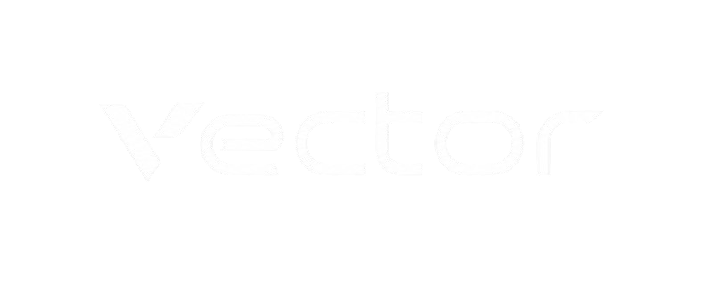
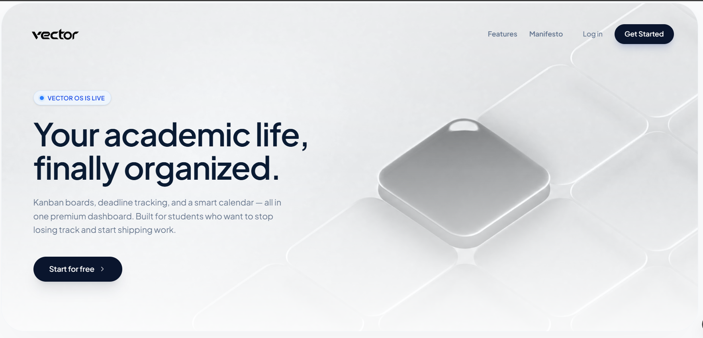
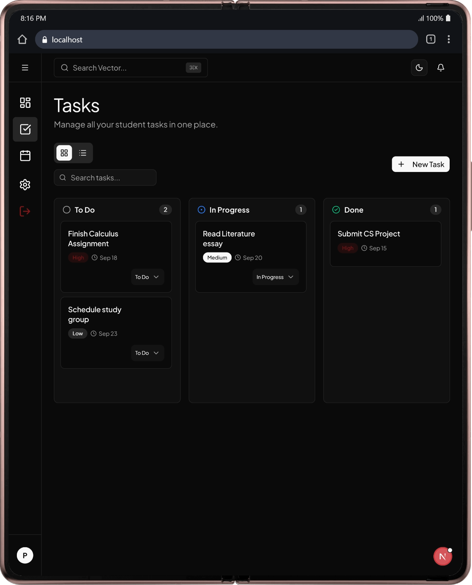
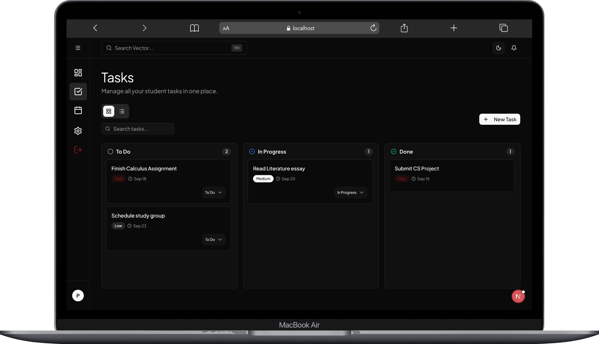
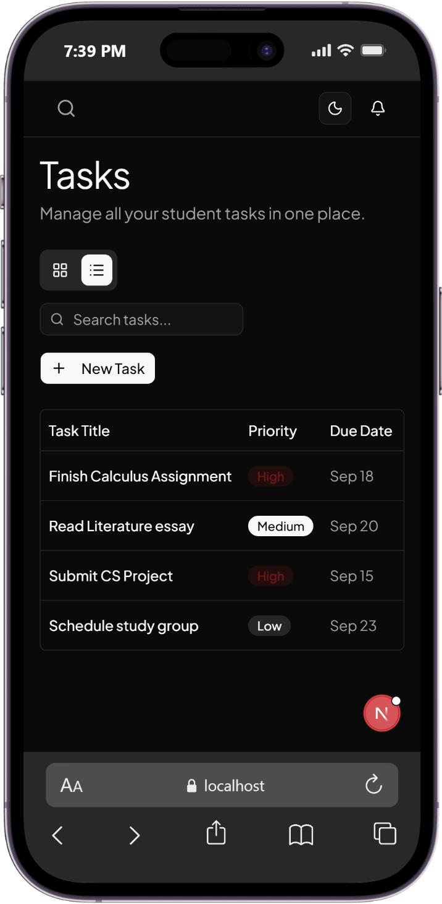
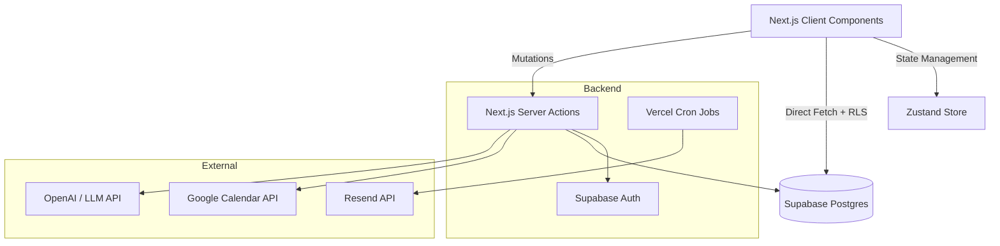

<div align="center">
  
  <br />
  <p>Your academic life, finally organized. A modern, kanban-driven operating system for students.</p>
  <br />
  <a href="https://vector.prodhosh.me">
    
  </a>
  &nbsp;
  <a href="https://vector.prodhosh.me/api-docs">
    
  </a>
  <br /><br />
  <p>
    <b>Live App:</b> <a href="https://vector.prodhosh.me">vector.prodhosh.me</a> &nbsp;|&nbsp; 
    <b>API Docs:</b> <a href="https://vector.prodhosh.me/api-docs">vector.prodhosh.me/api-docs</a>
  </p>
</div>

<br />

<div align="center">
  
</div>

<br />

<div align="center" style="display: flex; align-items: flex-end; justify-content: center; gap: 20px;">
  
  
  
</div>

<br />

## Table of Contents
- [Why I Built This](#why-i-built-this)
- [Features](#features)
- [Future Plans](#future-plans)
- [Tech Stack](#tech-stack)
- [Architecture](#architecture)
- [API Documentation (Swagger)](#api-documentation-swagger)
- [Running Locally](#running-locally)

## Why I Built This

As a student, I noticed a frustrating pattern when trying to organize my academic life. The current solutions on the market generally fall into two extremes:

1. **They are too expensive:** Any app that has genuinely useful integrations (like Google Calendar sync, AI features, or smart email reminders) hides them behind a pricey premium subscription that most students can't justify.
2. **They are too complicated:** Free tools (like Notion or Obsidian) are incredibly powerful, but they are completely blank canvases. We end up spending 5 hours setting up the "perfect" database with 50 custom properties, only to abandon it a week later because it requires too much daily maintenance.

I just wanted a free, smart tool to track my assignments effortlessly. 

That's why I built **Vector OS**. It gives you the best of both worlds: a completely free, minimalist Kanban board that's stupid-simple to use, but supercharged under the hood with premium automations (like automatic calendar syncing and weekly email reports) that do the heavy lifting for you.

## Features

### Core Task Management
- **Full CRUD Capabilities:** Create, read, update, and delete tasks instantly.
- **Secure Authentication & OAuth:** Built-in email/password auth via Supabase so your data stays yours. We also support seamless OAuth login flows (like Google) to make signing up frictionless.
- **Simple Kanban Boards:** Drag and drop your tasks between To Do, In Progress, and Done.
- **Priority & Deadlines:** Tag tasks as High, Medium, or Low, and set firm due dates.
- **Beautiful, Fast UI:** We use modern **shadcn/ui** components for a premium, accessible design. The dashboard updates instantly when you move things around, looking great on both desktop and mobile.

### Premium User Experience
- **Interactive Onboarding:** Built-in interactive product tours (powered by `driver.js`) that automatically guide new users through setting up their workspace and learning the ropes.
- **Global Command Menu:** Hit `Cmd + K` (or `Ctrl + K`) from anywhere in the app to instantly search tasks or navigate between pages using a sleek command palette.
- **Dark Mode Support:** Full support for system-preference or manual toggling of light and dark themes so your eyes don't burn while pulling all-nighters.
- **Smooth Animations:** We use `framer-motion` for fluid page transitions, drag-and-drop mechanics, and beautiful micro-interactions.

### Admin Capabilities
- **Admin Dashboard:** A dedicated, protected route (`/admin`) only accessible by users with the `is_admin` database flag.
- **Data Visualization:** We use **Recharts** to beautifully visualize user growth and task completion statistics directly in the admin panel.
- **Broadcast Emails:** Admins can write and broadcast update emails to all registered students directly from the dashboard, complete with full delivery logging.

### Automations That Actually Help
- **Google Calendar Sync:** Connect your Google account in settings. We use OAuth to securely pull your Google Calendar events straight into your task board and native calendar view, so you never double-book or miss a deadline.
- **Daily Deadline Reminders:** We send automated email alerts for tasks that are due within 24 hours or are overdue.
- **Weekly Wrap-up Reports:** Every Sunday, you get an email summarizing everything you accomplished that week, so you actually get credited for your hard work! It also lists what's on deck for next week.
- **Homepage Helper:** A simple AI chat assistant on the landing page to answer your questions and help you get started.

> **Why Vercel Cron Jobs instead of GitHub Actions?**  
> We power all of our email automations using Vercel Cron. We chose this over GitHub Actions because it's natively integrated with our Next.js API routes. It requires zero external YAML configuration, avoids cross-platform secrets management, and keeps our entire backend logic in one single codebase.


## Future Plans

Because our architecture is built to support scalable OAuth integrations, we are looking to expand our ecosystem soon while preserving our minimalist core interface:
- **Notion Integration:** Sync rows from your Notion databases directly into your Vector OS task list.
- **Canvas LMS:** Automatically pull in assignments and quizzes as soon as your professor posts them.
- **GitHub:** For CS students, sync assigned Issues and PR reviews.
- **Spotify & Pomodoro:** Native widgets for focus modes with your favorite study playlists.

<br />

## Tech Stack

We chose a modern, edge-ready stack optimized for speed and developer experience.

<div align="center">
  <table>
    <tr>
      <td align="center" width="25%">
        <br>
        <b>Next.js 14 & React</b>
      </td>
      <td align="center" width="25%">
        <br>
        <b>TypeScript</b>
      </td>
      <td align="center" width="25%">
        <br>
        <b>Tailwind & shadcn/ui</b>
      </td>
      <td align="center" width="25%">
        <br>
        <b>Supabase & PostgreSQL</b>
      </td>
    </tr>
    <tr>
      <td align="center" width="25%">
        <br>
        <b>Vercel Crons</b>
      </td>
      <td align="center" width="25%">
        <br>
        <b>Git & GitHub</b>
      </td>
      <td align="center" width="25%">
        <br>
        <b>Zustand</b>
      </td>
      <td align="center" width="25%">
        <br>
        <b>Resend API</b>
      </td>
    </tr>
  </table>
</div>

## Architecture

We use a hybrid data fetching approach. Server Actions handle heavy mutations and secure API calls (like Google Calendar sync), while the Supabase Client fetches data directly from the client side, protected by strict Row Level Security (RLS) policies. Background notifications are handled natively via Vercel Crons.



## Running Locally

1. Clone the repository
```bash
git clone https://github.com/yourusername/student-task-management.git
cd student-task-management
```

2. Install dependencies
```bash
npm install
```

3. Set up Supabase
Create a new Supabase project and run the provided SQL queries in `supabase/schema.sql` to set up your tables.

4. Set up Environment Variables
Copy `.env.local.example` to `.env.local` and fill in your Supabase URL and Anon Key.

```bash
cp .env.local.example .env.local
```

5. Run the development server
```bash
npm run dev
```

Visit `http://localhost:3000` to see the app running.

## API & Database Documentation

We fully document our backend using OpenAPI (Swagger). All database schemas, endpoint parameters, and response types are clearly defined.

You can view the interactive Swagger UI by visiting [vector.prodhosh.me/api-docs](https://vector.prodhosh.me/api-docs) in the browser. The raw OpenAPI specification file is located at `docs/openapi.yaml`.

Want to see our raw database structure? You can view the complete PostgreSQL schema in the [`supabase/schema.sql`](./supabase/schema.sql) file.

## Submission Details

This project was built as a full-stack student task management assignment. It fulfills all core requirements (CRUD, task organization, responsive UI) and all optional bonus features (Auth, Search, Due Dates, TypeScript, Error Handling).
